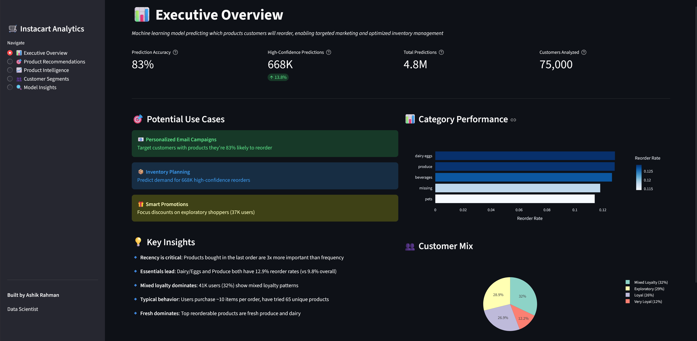
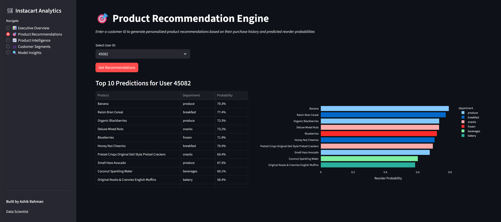
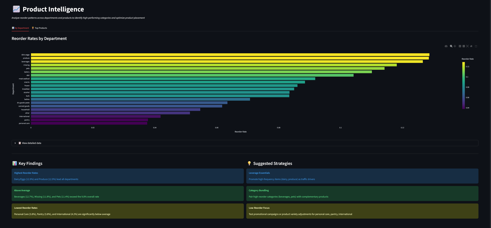
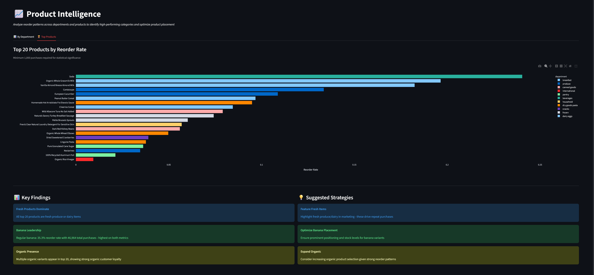
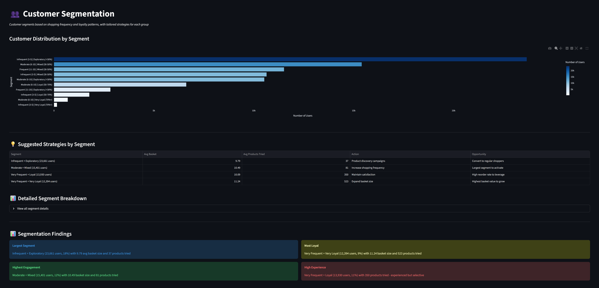
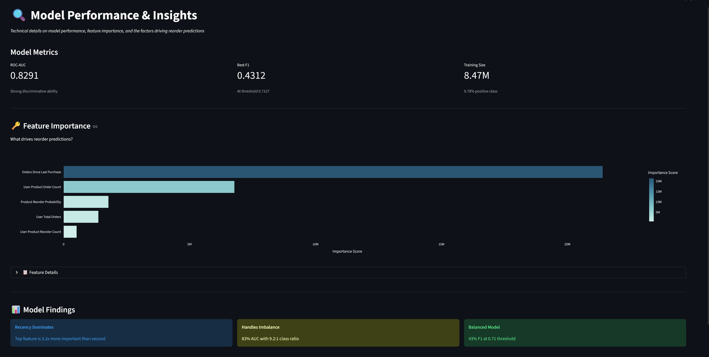

# Instacart Reorder Prediction - End-to-End Data Science Project

A machine learning system that predicts which products customers will reorder, enabling personalized marketing and optimized inventory management.

## 🚀 Live Dashboard

**[Click here to access the interactive Streamlit dashboard](https://instacart-reorder-prediction-j4qnxlunyx2yax9dcrea6a.streamlit.app/)**

Explore the model insights, customer segments, and product recommendations in real-time!

---

## 🎯 Project Overview

This project analyzes 3+ million grocery orders from 200,000+ Instacart users to predict reorder behavior. The predictive model achieves **83% accuracy (AUC)** and generates actionable business insights for customer segmentation and product strategy.

**Key Achievements:**
- Built end-to-end ML pipeline from data exploration to interactive dashboard
- Engineered 14 features capturing recency, frequency, and product popularity
- Handled 9.2:1 class imbalance to achieve strong predictive performance
- Created customer segmentation strategy for 131K users
- Deployed interactive Streamlit dashboard for business stakeholders

## 📊 Business Impact

**Predictions Generated:** 4.8M customer-product pairs analyzed  
**High-Confidence Recommendations:** 668K predictions with >70% probability  
**Model Performance:** 83% AUC, 43% F1 score

**Use Cases:**
- 📧 **Personalized Marketing**: Target customers with products they're 83% likely to reorder
- 📦 **Inventory Optimization**: Predict demand for high-confidence reorders
- 👥 **Customer Retention**: Segment-specific strategies for 5 distinct customer groups

## 🔍 Key Findings

1. **Recency is King**: Products purchased recently are 3x more predictive than purchase frequency
2. **Category Leaders**: Dairy/Eggs and Produce have highest reorder rates (12.9%)
3. **Customer Segments**: 32% of users show mixed loyalty - prime targets for retention campaigns
4. **Fresh Products Dominate**: All top 20 reorderable products are fresh produce or dairy

## 🛠️ Technology Stack

**Languages & Libraries:**
- Python 3.x
- pandas, numpy (data manipulation)
- scikit-learn, LightGBM (machine learning)
- matplotlib, seaborn, plotly (visualization)
- Streamlit (dashboard)

**Techniques:**
- Feature Engineering (14 features across user, product, and interaction levels)
- Class Imbalance Handling (scale_pos_weight)
- Gradient Boosting (LightGBM)
- Customer Segmentation (RFM-style analysis)

## 📁 Project Structure
```
instacart-analysis/
│
├── data/
│   ├── raw/                    # Original Kaggle dataset
│   └── processed/              # Cleaned and feature-engineered data
│
├── notebooks/
│   ├── 01_data_exploration.ipynb
│   ├── 02_feature_engineering.ipynb
│   ├── 03_modeling.ipynb
│   └── 04_insights_and_visualizations.ipynb
│
├── models/
│   ├── lgbm_reorder_model.txt
│   └── feature_importance.csv
│
├── images/                     # Dashboard screenshots
│
├── dashboard.py                # Interactive Streamlit app
├── requirements.txt
└── README.md
```

## 🚀 Getting Started

### 1. Clone the Repository
```bash
git clone <repository-url>
cd instacart-analysis
```

### 2. Set Up Environment
```bash
python -m venv venv
source venv/bin/activate  # On Windows: venv\Scripts\activate
pip install -r requirements.txt
```

### 3. Download Dataset
- Visit [Instacart Market Basket Analysis on Kaggle](https://www.kaggle.com/c/instacart-market-basket-analysis/data)
- Download all CSV files
- Place in `data/raw/` folder

### 4. Run Notebooks (Optional)
Notebooks are already executed with results. To rerun:
```bash
jupyter notebook
```
Navigate to `notebooks/` and run in order: 01 → 02 → 03 → 04

### 5. Launch Dashboard
```bash
streamlit run dashboard.py
```
The dashboard will open at `http://localhost:8501`

## 📈 Dashboard Features

### Executive Overview
High-level metrics and business insights for stakeholders.



### Product Recommendation Engine
Generate personalized top-10 product recommendations for any customer.



### Product Intelligence
Analyze reorder patterns across departments and identify top products.





### Customer Segmentation
View customer segments with tailored strategies for each group.



### Model Insights
Technical details on model performance and feature importance.



## 🧠 Methodology

### 1. Data Exploration
- Analyzed 3.4M orders from 206K users
- Identified patterns in shopping frequency (peak: weekends, 9-10am)
- Calculated baseline reorder rate: 59%

### 2. Feature Engineering
Created 14 features across three levels:

**User-Level Features:**
- Total orders, average days between orders
- Reorder rate, average basket size

**Product-Level Features:**
- Total purchases, reorder probability
- Number of unique users

**User-Product Interaction Features:**
- Purchase count, reorder count, reorder rate
- **Orders since last purchase** (most important feature)

### 3. Modeling
**Algorithm:** LightGBM (Gradient Boosting)

**Training:**
- 8.47M examples (131K users)
- 80/20 train/validation split
- Handled 9.2:1 class imbalance with scale_pos_weight

**Performance:**
- ROC-AUC: 0.829
- Best F1: 0.431 (threshold: 0.71)
- Precision: 38%, Recall: 50%

### 4. Business Insights
- Segmented customers into 5 groups (frequency × loyalty)
- Identified category-level reorder patterns
- Generated segment-specific strategies

## 📊 Model Performance

| Metric | Value | Interpretation |
|--------|-------|----------------|
| ROC-AUC | 0.829 | Strong discriminative ability |
| F1 Score | 0.431 | Balanced precision/recall at optimal threshold |
| Precision | 38% | 38% of predicted reorders are correct |
| Recall | 50% | Captures 50% of actual reorders |

**Feature Importance (Top 5):**
1. Orders Since Last Purchase (21.4M) - **Dominant feature**
2. User-Product Order Count (6.8M)
3. Product Reorder Probability (1.8M)
4. User Total Orders (1.4M)
5. User-Product Reorder Count (0.5M)

## 💡 Business Recommendations

### By Customer Segment:

**Infrequent + Exploratory (23.7K users, 18%)**
- Focus: Product discovery campaigns
- Opportunity: Convert to regular shoppers

**Moderate + Mixed (15.4K users, 12%)**
- Focus: Increase shopping frequency
- Opportunity: Largest segment to activate

**Very Frequent + Loyal (13.9K users, 11%)**
- Focus: Maintain satisfaction
- Opportunity: High reorder rate to leverage

**Very Frequent + Very Loyal (12.4K users, 9%)**
- Focus: Expand basket size
- Opportunity: Highest basket value customers

### By Product Category:

**High-Reorder Categories** (Dairy/Eggs, Produce, Beverages):
- Use as traffic drivers
- Promote for customer acquisition

**Low-Reorder Categories** (Personal Care, Pantry, International):
- Test promotional campaigns
- Consider product variety adjustments

## 📝 Future Improvements

- **Deep Learning**: Test LSTM/Transformer models for sequence prediction
- **Real-Time Scoring**: Deploy model as REST API
- **A/B Testing Framework**: Measure impact of recommendations
- **Expanded Features**: Include pricing, promotions, seasonality
- **Multi-Model Ensemble**: Combine multiple algorithms

## 👨‍💼 Author

**Ashik Rahman**  
Data Analyst | Data Scientist

**Skills Demonstrated:**
- End-to-end ML pipeline development
- Feature engineering and model optimization
- Data visualization and storytelling
- Business strategy and stakeholder communication
- Dashboard development (Streamlit)

## 📄 License

This project is for educational and portfolio purposes.

## 🙏 Acknowledgments

- Dataset: [Instacart Market Basket Analysis (Kaggle)](https://www.kaggle.com/c/instacart-market-basket-analysis)
- Inspiration: Real-world e-commerce recommendation systems